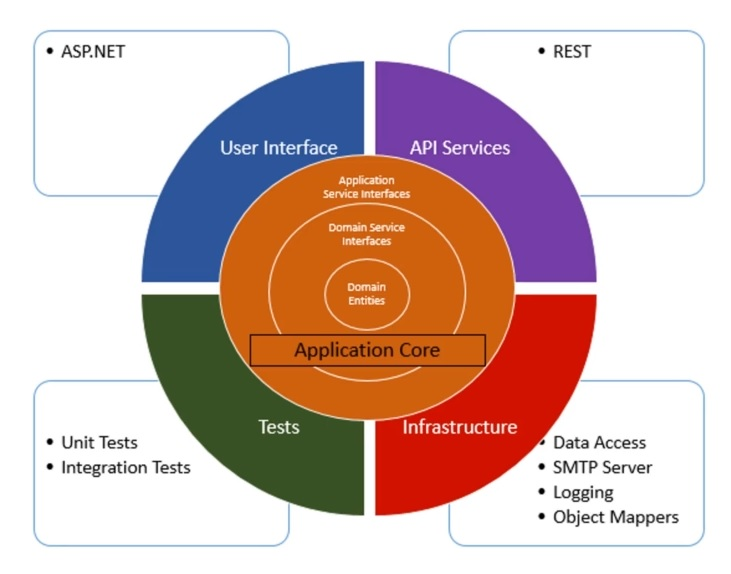
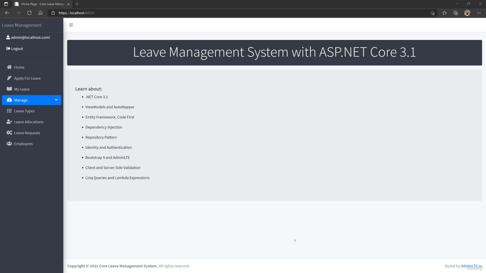

# Summary
.NET 6 - Full stack application representing a management system for the human resources department of a fictional company, written with Clean Architecture, CQRS Structure and Mediator Pattern 📝. The main entry point for the management system is to demonstrate the best practices and SOLID Principles when building an application in .NET. 

# Architecture:

    

# Application preview:

    

# Aquired Skils:
* Clean or Onion Architecture and Best Practices
* Command Query Responsibility Segregation (CQRS)
* Implement Mediatr Pattern
* Email Service using SendGrid
* Implementing Unit Testing
* Moq and Shouldy Frameworks
* Global Error Handling with Custom Middleware and Exceptions
* Adding Validation Using Fluent Validation
* .NET Core API and MVC UI Application
* Implement JWT(JSON Web Token)  Authentication
* Implement SOLID Principles

# References
> The complete course can be found here [page](https://www.udemy.com/course/aspnet-core-solid-and-clean-architecture-net-5-and-up).

